# Credit_Risk_Analysis

---
## Background
### Purpose
* The purpose of this analysis is fairly simple: To aid, "Fast Lending"--a peer-to-peer lending services company-- in creating an optimal machine learning algorithim for predicting credit risk so they can provide a quicker and more reliable loan experience. The company believes machine learning will lead to a more accurate identification of good loan candidates, resulting in decreased default rates. 

### High-Level Overview
* In conducting this analysis, I built and evaluated several machine learning models/algorithms to predict credit risk. Further, I employed a variety of techniques based on the model I was working with such as, resampling and boosting, to unlock the full potential of each model's capabilities. 
* After the above analysis was completed, it was determined that the optimal machine learning algorithm for this instance was the Easy Ensemble AdaBoost Classifier. 
---
## Results
#### *First Model: Oversampling - RandomOverSampler*
* In describing the results of the first sampling technique I used--Random OverSampling-- I will detail each step of the process. I will only be doing this for this model because the others all follow a similar pattern, so only the actual results will be analyzed for them. 

##### **Step 1: Import Dependency, Instantiate a RandomOverSampler Object, Perform OverSampling/Display Results**
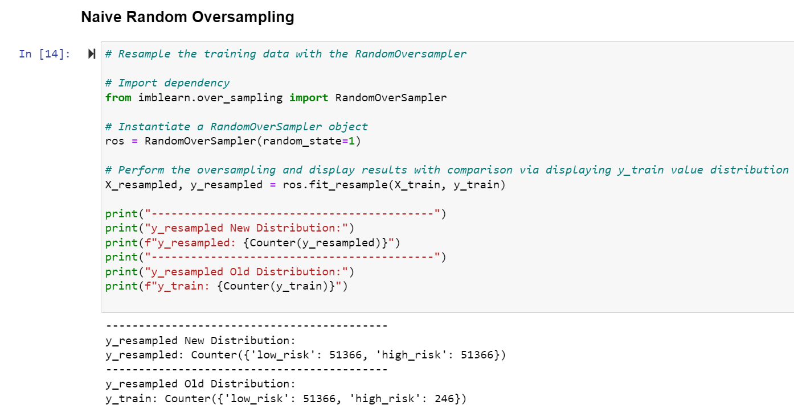
* As shown above, I begin by importing the dependency necessary to perform the RandomOverSampling technique. Then, I instantiate a RandomOverSampler object and establish a         random_state parameter of 1 for consistency across all models. Finally, I perform the RandomOverSampling technique on our training set to handle the large class imbalance       present in our dataset, (large majority in favour of low risk of loan default vs. opposite) and display the results by using the 'Counter' method on the 'y_resampled' variable   and printing that result and the 'y_train' distribution (old distribution) using the same method, and I also did a little formatting for aesthetics. As evidenced by the 'New     Distribution' results, the class imbalance no longer exists and the frequency of the former minority class now equals the frequency of the former majority class in the           dataset. The following image presents a good visualization of the concept: 
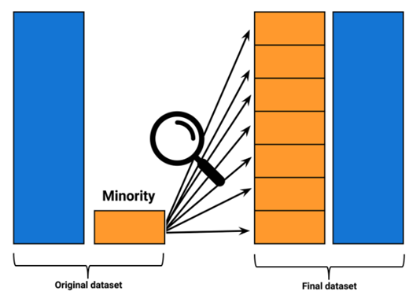

##### **Step 2: Perform Logistic Regression and Make Predictions**
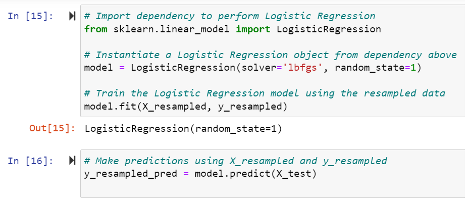
*  The above image displays that I begin this step by importing the dependency necessary to perform logistic regression.
*  Next, I instantiate a LogisticRegression object and specify two parameters. 
*  Then, I use the now RandomlyOverSampled data to train the model.
*  Lastly, I use the logistic regression model that I just trained using the RandomlyOverSampled data to predict the tagret variable for all of the features in the 'X_test'        dataset.

##### **Step 3: Create DF to Hold Model's Prediction Results**
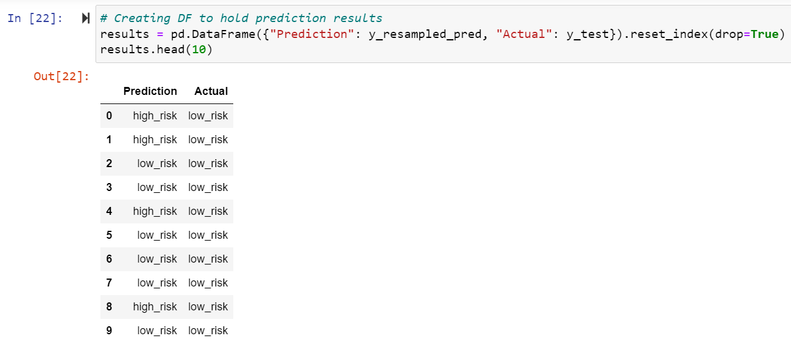
*  Here, I simply create a DataFrame and specify each column name and its values using Python dictionary syntax (curly braces with k:v pairs).
*  Then, I display the first 10 results held in this DF.

##### **Step 4: Balanced Accuracy Score**
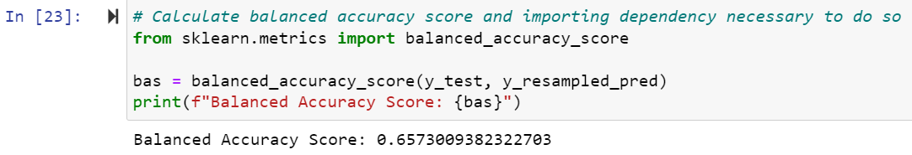
*  Above, the model's balanced accuracy score (BAS) is determined by calculating the percentage of predictions made by the model that turned out to be correct. 
*  As you can see, this model's BAS is approx. 66%.

##### **Step 5: Confusion Matrix**

*  A confusion matrix is generated and displayed. 
*  A confusion matrix holds columns of, "Predicted True" and, "Predicted False". Followed by row indexes of, "Actually True" and, "Actually False". 
*  As seen via my confusion matrix above, the number of true predictions (high risk) the model made, which actually turned out to be true totals only 72. Further, the number of    false predictions made by the model that actually were false is much higher at 10,292. This makes sense because the RandomOverSampling technique simply takes some existing      datapoints from the minority class and duplicates them until the classes are equal in size. Although this should be better than not doing so, the result is logical because      the "high risk" class is significantly outnumbered by the "low risk" class. Therefore, there is more distinct data for the logistic regression model to base its linear model    off of for this class, resulting in more accuracy for this class.

##### **Step 6: Imbalanced Classification Report**
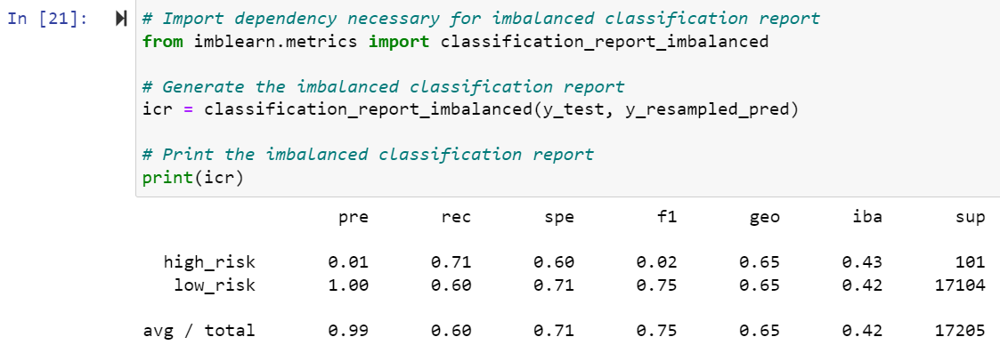
*  An imbalanced classification report (ICR) is created and displayed which shows the accuracy, precision, f1, etc. scores for each class, as predicted by the model. 

*  The results from the above ICR indicate that of the total number of features predicted to be a high credit risk, only 1% of them were actually deemed a high credit risk in      reality. Further, the recall (sensitivity) results for the same class show that out of all the features that were actually deemed a high credit risk in reality, the model        managed to capture 71% of them. In this situation it is important to note that this result can be misleading because the 71% is indicating that there weren't many false          negatives, which makes sense because 100% of the model's "low risk" class predictions turned out to be accurate. In other words, the 71% is misleading because it means the      model managed to correctly identify/predict 71% of the total results that were actually high risk in reality, however, since the precision is so low, this signals that          despite the 71% recall, the model is not a good one because the 71% of total actual positives the model identified constitute only 1% of the model's actually true                predictions. Therefore, for every correct actual positive prediction the model made, there was 71x the amount of positive predictions that turned out to be false. This          potential misconception is very noticeable via the model's f1 score for the high risk class. Now, when you look at the low risk class, the precision is 100%, which is good.      However, this too can be a tad deceiving because the model's recall score for this class is only 60%, meaning only 60% of the total features that were low risk in reality        were identified as low risk by the model. 

*  In my opinion, the more important metric for this model, given the context/purpose of the situation, (accurately identifying good loan candidates) is the sensitivity or          recall metric for the "high risk" class because the lower this is, the more high risk candidates there are that the ML model is not identifying and actually classifying as      "low risk" candidates. 

*  Further, although precision is important, I believe Fast Lending would rather identify some good candiates as bad, opposed to classifying some bad candidates as good            because the latter would surely increase their default rates rather than achieve the goal of this project--decreasing their default rates. In other words, it is better to        risk an increase of false positives (ML model predicts high risk when in reality they are low risk) to likely increase the percentage of total true negatives predicted by the    model because if a loan applicant is classified as high risk, but in reality they are not, it is easy to reapply and request a human-review of their application. However, if    we were to prioritize the model's high risk class precision and risk the respective recall, (have more actual high risk applicants classified as low risk --> but have more      precision amongst the model's predicted positives) it seems logical that Fast Lending's default rates would increase, rather than the desired maximum decrease.
---
#### *Second Model: OverSampling - SMOTE*
* "Synthetic Minority Oversampling Technique", or SMOTE for short, is another oversampling technique aimed at solving the problem presented by signifcant class imbalance. 
* SMOTE differs from RandomOverSampling because instead of copying existing datapoints from the minority class, SMOTE selects a number of datapoints from the minority class, and   will interpolate new, synthetic datapoints based on each of neighbour's values. The following image displays the concept: 

**Balanced Accuracy Score (BAS)**

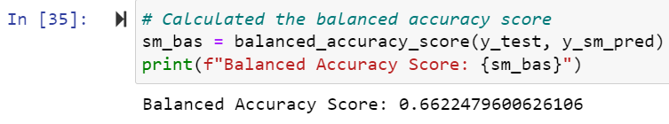
* As you can see, although SMOTE's BAS is minutely better than the one provided via RandomOverSampling, it still approximates only 66%.

**Imbalanced Classification Report (ICR)** 

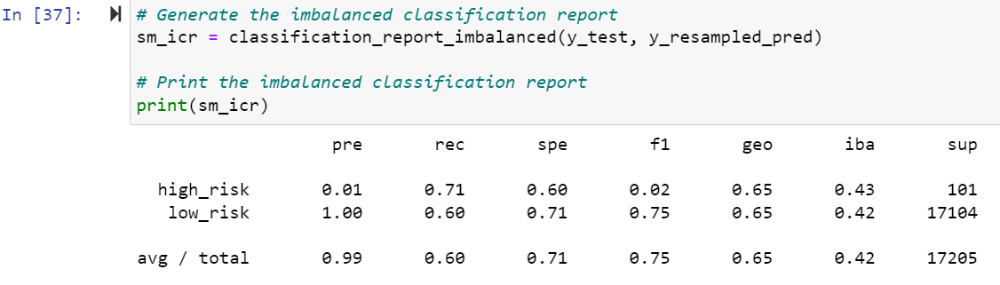
* The above ICR is identical to the one calculated from the RandomOverSampler technique and therefore, the same analysis applies.
---
#### *Third Model: Undersampling - The ClusterCentroids Algorithm*
* Undersampling is the exact opposite of oversampling. Instead of increasing the size of the minority class to equal that of the majority class, the majority class is decreased   to equal the size of the minority class.
* The, "ClusterCentroids" (CC) sampling algorithm does this by implementing a technique very similar to SMOTE, except with undersampling. So, the CC algorithm identifies           clusters of the majority class. Then, it generates new synthetic datapoints--called centroids-- that are representative of the clusters, and will replace these clusters. Once   this is done, the majority class is undersampled down to the size of the minority class.

**BAS**

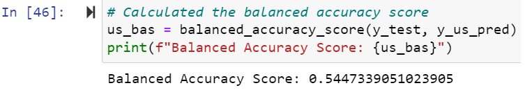
* The CC algorithm gives us our lowest BAS thus far, coming in at only approx. 54%.

**ICR**
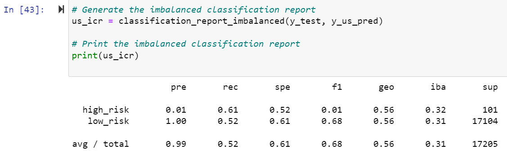

* Compared to the two ICR's generated from the two oversampling techniques discussed above, the CC algorithm displays lower precision and recall metrics for the "high risk"       class than them. 
* And although the precision metric for the "low risk" class is the same, at 100%, the recall for this class is also worse than the two previous models.
* Overall, the CC undersampling algorithm seems to be the worst fit for our data thus far.
---
#### *Fourth Model: Combination Sampling - SMOTEENN*
* One way to address the con(s) presented by oversampling and undersampling techniques is to use a sampling strategy that is a combination of oversampling and undersampling:       SMOTEENN.
* SMOTEENN first uses the SMOTE oversampling technique to oversample the minority class.
* Then, SMOTEENN cleans the resulting data with the following undersampling strategy: If the two nearest neighbours of a datapoint belong to a different class than this           datapoint, that datapoint is dropped.

**BAS**

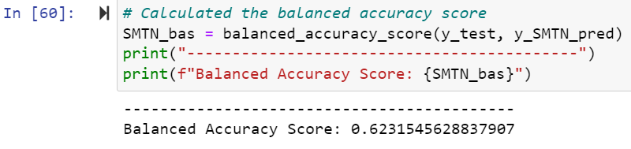
* The SMOTEEN combination sampling technique provided a BAS of approx. 62%. 

**ICR**
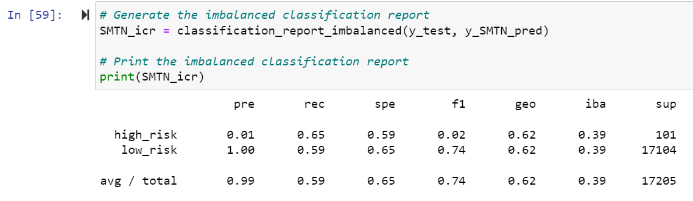

* The SMOTEENN ICR displays an identical true positive precision score to all three prior models.
* Further, it shows a slightly higher positive (high risk) recall than the CC model, yet a lower positive recall than both of the oversampling technniques (RandomOverSampling     and SMOTE).
---
#### *Fifth Model: Ensemble Algorithm - Balanced Random Forest Classifier*
* In an effort to improve the model's performance, I employed two ensemble learning algorithms. The first one is the Balanced Random Forest Classifier (BRFC).
* Ensemble learning is based on the idea that two is better than one. The concept of ensemble learning is the process of combining multiple models to help improve the accuracy     and robustness, as well as decrease variance of the model. Thereby, increasing the overall performance of the model.
* For example, what we're doing here is employing several smaller and more simple decision trees (vs. one single complex tree) using the the Random Forest algorithm.
* The Random Forest algorithm will sample the data and build several smaller, simpler decision trees that will each use different samples of the original dataset for their         respective training and testing sets.
* The logic behind this persists that by combining these small trees (weak learners)--whose output can only be deemed slightly better than a random guess (slightly better than     the natural average) since each model is based on a small, randomly sampled portion of the original data--we can create a a strong learner with much better decision making       power.

**BAS**

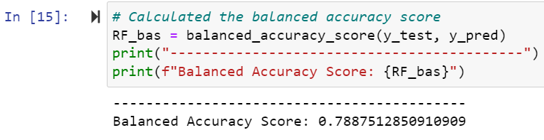
* The BRFC's BAS is approx. 79% making it the highest one yet.

**ICR**

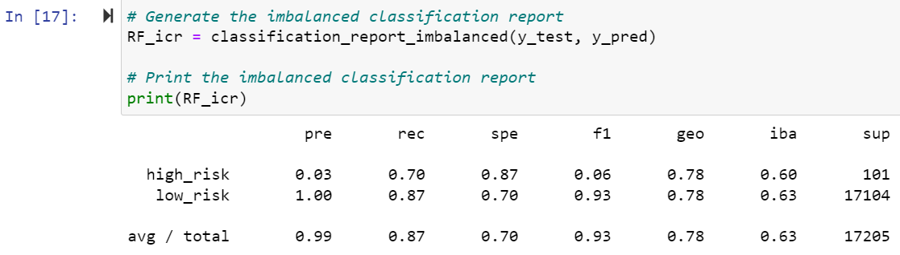
* The BRFC's ICR indicates an increase in both precision and recall for the high risk class when compared to all other models evaluated thus far.
---
#### *Sixth Model: Ensemble Algorithm - Easy Ensemble AdaBoost Classifier*
* Instead of the bootstrap aggregation, (an ensemble learning technique used within the Random Forest algorithm) this model uses 'boosting'
* Bootstrap aggregation (AKA 'bagging') has two parts:
    * 1. Bootstrapping - A sampling technique with which a number of samples are made, and in which an observation can occur multiple times
    * 2. Aggregation - When different classifiers are run using the samples drawn from the bootstrapping stage and the results from each are taken and aggregated via a voting            process and the winner (final prediction) is the one with the most votes amongst the classifiers
* 'Boosting' is another technique used to combine weak learning models into a strong learning model.
* The major difference that separates bagging and boosting is that in bagging, multiple weak learners are combined at the same time to arrive at a combined result. Whereas in     boosting, the weak learners are not combined at the same time, but rather, they are used sequentially as one model learns from the mistakes of the previous model: 
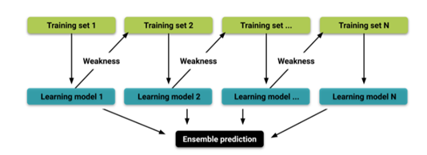

**BAS**

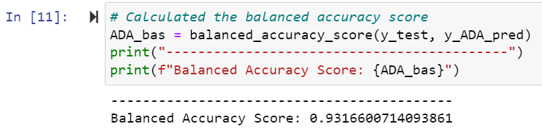
* The BAS of this model is approx. 93% making it by far the highest BAS amongst the other five models above.

**ICR**

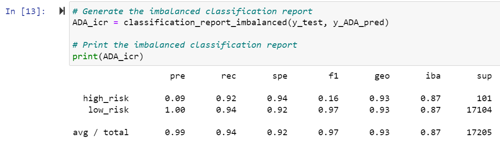
* Unsurprisingly, the AdaBoost model displays highs across all categories of the ICR.
---
## Summary
* In summary, our observations suggest that the AdaBoost model is by far and away the optimal machine learning model for Fast Lending to decrease their loan default rates and     thereby, based on the observations and insights above, I highly recommend Fast Lending employ this model in their attempt to decrease their loan default rates and provide a     quicker and more reliable loan experience to their customers.
